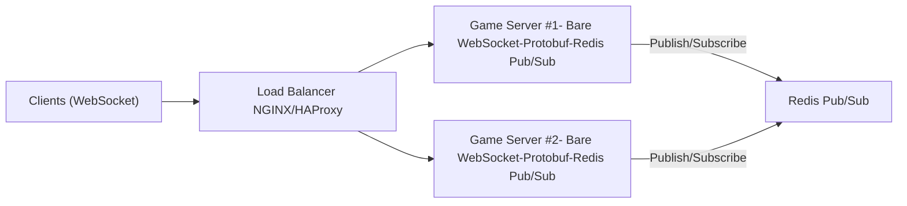

Note: due to some legal issues and the current studios using the engine developed internally for them, I'm unable to release the same code base here. Therefore a new revision with certain changes/differences with we have already sold as a closed source must be developed and get open sourced here. Unfortunately I am very busy at the moment with other projects at until end of 2025. Will update this repo beginning of 2026 with a new version. Currently I need front-end developer/designers contributors for this project as we need some UI for management dashboard. If you were interested please drop me a line at my LinkedIn message or email.

Below is the data that you can adapt to your GitHub repository by forking this repo. It explains the project’s motivation, architecture, setup instructions, and extension points for future maintainers.

#### Motivation
My wife is a game designer and she asked me to create a game server for her. I started to look for a game server that could be used for her game, but I couldn't find anything ready made and had ultra-low latency capabilities since mostly they are packed with features which might never be used. So I decided to create one.

# **Ultra-Low-Latency Java Game Server**

A **bare-bones, scalable game server** in Java designed for **ultra-low latency** turn-based games (like chess). This project demonstrates:

- **Pure Java WebSocket** implementation (no Tomcat/Jetty/Netty).
- **Protobuf-based message serialization** for efficient data transfer.
- **Redis Pub/Sub** for horizontal scaling across multiple server instances.
- **Nginx/HAProxy** or similar load balancer for distributing WebSocket connections.

Although **chess** is used as the example, the same architecture can be extended to **lightweight real-time or turn-based** games.

## **Table of Contents**
1.	[Project Overview](#project-overview)
2.	[Architecture](#architecture)
3.	[Features](#features)
4.	[Prerequisites](#prerequisites)
5.	[Setup & Installation](#setup--installation)
6.	[Running the Server](#running-the-server)
7.  [Testing Locally](#testing-locally)
8.	[Scaling with Redis & Load Balancers](#scaling-with-redis--load-balancers)
9.	[Project Structure](#project-structure)
10.	[Extending & Customizing](#extending--customizing)
11.	[FAQ](#faq)
12. [License](#license)

## **Project Overview**

This repository contains an ultra-lightweight WebSocket server written in pure Java. It is designed for turn-based games where latency and reliability are crucial. By default, it shows how to handle chess moves, but it can be extended to any minimal real-time or turn-based gaming scenario.

Key goals:
   -	Minimal Dependencies: No Tomcat, no Jetty, no Spring Boot—just Java’s ServerSocket.
   -	Scalability: Horizontal scaling through Redis Pub/Sub.
   -	Efficient Data Serialization: Use of Protocol Buffers (Protobuf) to minimize message size and parsing overhead.
   -	Maintainability: Simple code structure that’s easy to extend for new features or different game types.

## **Architecture**



1.	Bare WebSocket Server: Handles game actions (like chess moves) via WebSocket frames (no HTTP polling).
2.	Protobuf Messages: Minimizes data size & improves parse speed.
3.	Redis Pub/Sub: Broadcasts moves between servers. This allows multiple server instances to stay in sync.
4.	Load Balancer: Distributes WebSocket connections evenly among all servers.

## **Features**
1.	Ultra-Lightweight Server
    -	No external application servers; just Java Sockets and a WebSocket handshake.
2.	Real-Time Communication
    -	Uses WebSockets for near-instant updates (no HTTP polling overhead).
3.	Protobuf Serialization
    -	Smaller message payloads than JSON or XML.
    -	Strongly typed schemas.
4.	Redis Pub/Sub for Scaling
    -	Multiple server instances can sync game states.
    -	Servers publish or subscribe to `chess_moves` channel (or any other channel you want).
5.	Load Balancer Integration
    -	Example config for Nginx to handle WebSocket connections.

## **Prerequisites**

-	Java 8+ (or any modern JDK).
-	Maven (or Gradle) for dependency management (if you choose to package your server this way).
-	Protobuf Compiler (protoc)
-	Install via GitHub Releases or your package manager.
-	Redis (for Pub/Sub), optional but required for scaling.

## **Setup & Installation**
1.	Clone the Repository
2.	Install Protobuf Compiler
    -	macOS: `brew install protobuf`
    -	Ubuntu/Debian: `sudo apt-get install protobuf-compiler`
    -	Windows: Download from Protobuf Releases.
3.	Compile Protobuf Schema (if you have a `.proto` file such as `chess.proto`)
    -   bash: `protoc chess.proto`

```bash
protoc chess.proto
```
Adjust the paths to match your project structure.
4.	Build the Project
    -	Maven: `mvn clean install`
    -	Gradle: `gradle build`

## **Running the Server**

Note: The simplest approach is to run your main class (e.g `BareWebSocketServer`) directly from your IDE or command line after compiling.
Though, you can also package your server as a JAR file and run it as a standalone application. But I'm a fan of running it the hardway from CLI as I'm an Nvim user. I don't use Arch btw.

1.	Start Redis (if you want scaling)

```bash
redis-server
```
2.	Run Single Server

```bash
java -cp target/UltraLowLatencyGameServer-1.0-SNAPSHOT.jar com.example.BareWebSocketServer
```

This starts a WebSocket server on `ws://localhost:8080`.

3.	Optional: Run Multiple Servers Manually
    -	Change the port in your second server instance (e.g., to 8090) and start it.
    -	Both servers connect to Redis. Moves from one server are published; the other server subscribes and broadcasts to its connected clients.

## **Testing Locally**

1.	Open Browser Console or use a WebSocket client (e.g., websocat or Postman) to connect:

```javascript
const ws = new WebSocket("ws://localhost:8080");
ws.onopen = () => {
    console.log("Connected");
};
ws.onmessage = (event) => {
    console.log("Server says:", event.data);
};
ws.onclose = () => console.log("Disconnected");
```

2.	Send a “move” from one client, see if all other connected clients receive it in real-time.

## **Scaling with Redis & Load Balancers**

1.	Redis Pub/Sub
    -	Each server publishes any incoming move to a Redis channel (e.g., "chess_moves").
    -	Each server subscribes to that same channel, receiving moves from other servers.
2.	Load Balancer (Nginix)
    -	Install & configure Nginx for WebSocket load balancing.
    -	Run Nginx, and direct all WebSocket connections to `ws://yourserver.com/`.

```nginx
http {
  upstream chess_game {
    server localhost:8080;
    server localhost:8085;
  }
  server {
    listen 80;
    server_name yourserver.com;

    location / {
      proxy_pass http://chess_game;
      proxy_http_version 1.1;
      proxy_set_header Upgrade $http_upgrade;
      proxy_set_header Connection "upgrade";
    }
  }
}
```

3.	Multiple Servers
    -	Start multiple instances (e.g by running `java BareWebSocketServer`) on different ports (8080, 8085, 8100…).
    -	All instances read from the same Redis server, ensuring real-time synchronization.

## **Project Structure**

```plaintext
UltraLowLatencyGameServer/
├── src/
│   ├── main/
│   │   ├── java/
│   │   │   ├── com/example/
│   │   │   │   ├── BareWebSocketServer.java
│   │   │   │   ├── RedisHandler.java
│   │   │   │   ├── ChessMove.java (generated by Protobuf)
│   │   │   │   └── ...
│   │   └── proto/
│   │       └── chess.proto
├── pom.xml (if using Maven)
├── README.md
└── ...
```

1.	`chess.proto` – Defines the Protobuf message for a chess move (or any turn-based action).
2.	`BareWebSocketServer.java` – The core WebSocket server implementation without any external containers.
3.	`RedisHandler.java` – Subscribes/publishes moves to Redis.
4.	`ChessMove.java` – Auto-generated by Protobuf compiler from `chess.proto`.

## **Extending & Customizing**

1.	Adding a New Game
    -	Create a new `.proto` schema with the required fields for your game’s events.
    -	Generate Java classes using `protoc`.
    -	Adjust `BareWebSocketServer` or create a new server class to handle these game events.
2.	Improving Security
    -	Implement TLS (using `wss://`) at the load balancer (NGINX) or within the Java server.
    -	Add authentication tokens to WebSocket messages to identify players.
3.	State Management
    -	Use an in-memory or Redis store to keep track of each game’s state (e.g., board positions, turn timers).
4.	High Availability
    -	Deploy servers behind a Kubernetes or Docker Swarm cluster.
    -	Use a managed Redis service (e.g., AWS ElastiCache).

## **FAQ**

1.	Why not use HTTP Polling?
    -	WebSockets provide lower overhead and real-time updates. HTTP Polling is inefficient and increases latency.
2.	Why Protobuf instead of JSON?
    -	Smaller payloads and faster parsing. In real-time games, every millisecond counts.
3.	Can I run more than two servers?
    -	Absolutely. Just add more servers (S3, S4, …), all subscribing to the same Redis Pub/Sub channel.
4.	How to handle concurrency or locking on game state?
    -	Typically, you’ll maintain a consistent game state in a shared store (Redis, database) or implement row-level locks if needed. For simple turn-based games, a single server thread is often sufficient.
5.	Is it production-ready?
    -	This project is a foundation. You should add error handling, security, and robust load testing before going live.

## **License**

MIT License – Feel free to modify and distribute. Contributions are welcome!

Happy coding and scaling! If you have any questions, open an issue. We’d love to hear how you’re using this for your own game projects.

I would keep updating this project with new features and improvements. If you have any suggestions, feel free to open an issue or a pull request. If you want to use this project
please give me a star and fork this project. It will help me a lot. Thank you for reading this README.md file. Have a nice day! 😊

